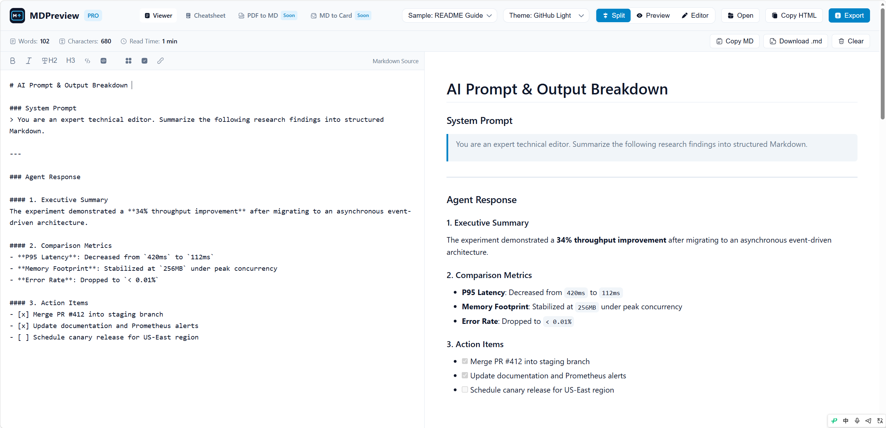

  
  
  
  
  

  <a href="https://mdpreview.dev"><strong>🌐 Launch App</strong></a> &bull;
  <a href="https://mdpreview.dev/md-to-card.html"><strong>🎨 Markdown to Card</strong></a> &bull;
  <a href="https://mdpreview.dev/pdf-to-md.html"><strong>📄 PDF to Markdown</strong></a> &bull;
  <a href="https://mdpreview.dev/es/"><strong>🇪🇸 Español</strong></a> &bull;
  <a href="https://mdpreview.dev/pt/"><strong>🇵🇹 Português</strong></a> &bull;
  <a href="https://github.com/tangtang-it/mdpreview/issues"><strong>💬 Feedback</strong></a>

---

# MdPreview

**The modern, privacy-first Markdown workstation and visual rendering suite.**

Real-time split preview, math equation rendering (KaTeX), social card generation, and 100% offline client-side PDF conversion.

👉 **Start using now**: [https://mdpreview.dev](https://mdpreview.dev)

---

## 💡 Why MdPreview?

Markdown is the lingua franca of developers and creators, but common tooling comes with compromises:

| Traditional Online Editors | MdPreview Solution |
| :--- | :--- |
| **Cloud uploads** risk exposing private drafts or confidential docs | **100% Local Processing** in your browser; zero telemetry on text |
| Plain, uninspired output unsuitable for social sharing | **1-Click Social Cards** styled for Twitter/X, Xiaohongshu & WeChat |
| Weak math equation & code highlighting support | **Full KaTeX & syntax highlighting** out-of-the-box |
| Heavy desktop installs required for PDF workflows | **WASM-powered PDF-to-Markdown** directly inside your browser |

---

## ✨ Core Capabilities

### 1. ⚡ Instant Real-Time Preview
Split-pane editing with synchronized scrolling, supporting GitHub Flavored Markdown (GFM), task lists, tables, footnotes, and emoji.

### 2. 🎨 Markdown to Social Card Generator
Turn snippets, quotes, or thoughts into share-ready visual cards with customizable aspect ratios (16:9, 1:1, 4:5, 3:4), gradients, dark/light themes, and typography presets.

### 3. 📄 Client-Side PDF to Markdown
Convert local PDF documents into structured Markdown directly in the browser using Web Workers and pdfjs-dist. Fast, private, and requires zero software installation.

### 4. 📐 Academic-Grade Math & Code Blocks
Native KaTeX integration for seamless LaTeX math formulas, plus syntax highlighting for 100+ programming languages powered by highlight.js.

### 5. 🔒 Zero-Knowledge Privacy Architecture
No account required. Your files, keystrokes, and converted documents never leave your local machine.

---

## 🛠️ Tech Stack

- **Framework & Tooling**: Vite 6, TypeScript 5
- **Parsing & Math Engine**: Marked, KaTeX, highlight.js
- **Graphics & Rendering**: html-to-image, pdfjs-dist
- **Deployment**: Global CDN static delivery

---

## 🗺️ Roadmap

- [x] Real-time split Markdown editor
- [x] KaTeX math equation rendering
- [x] Social Card Generation suite with multi-ratio export
- [x] Client-side PDF-to-Markdown converter
- [x] Multi-language SEO & localization (EN, ES, PT)
- [ ] Batch image/card export presets
- [ ] Browser extension for instant web clipping to Markdown
- [ ] Direct export to Notion & Obsidian formatted bundles

---

## 🤝 Feedback & Community

Have a feature request, bug report, or feedback?

- **Bug Reports & Ideas**: Open an issue on [GitHub Issues](https://github.com/tangtang-it/mdpreview/issues)
- **Live Application**: [https://mdpreview.dev](https://mdpreview.dev)

---

## 📄 License

This repository documentation and public assets are licensed under the [MIT License](LICENSE).
Copyright (c) 2026 [tangtang-it](https://github.com/tangtang-it).